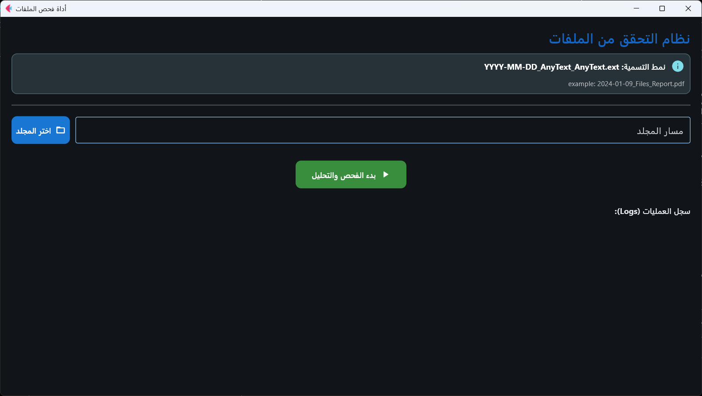
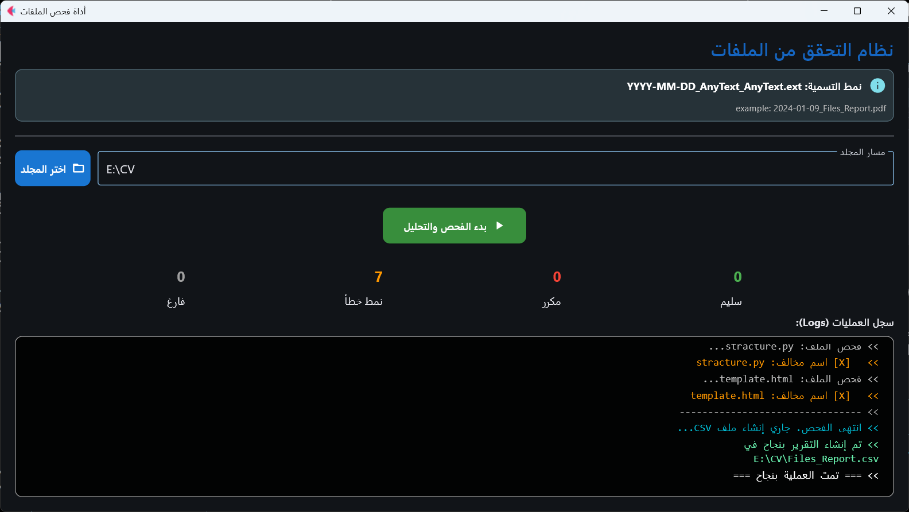
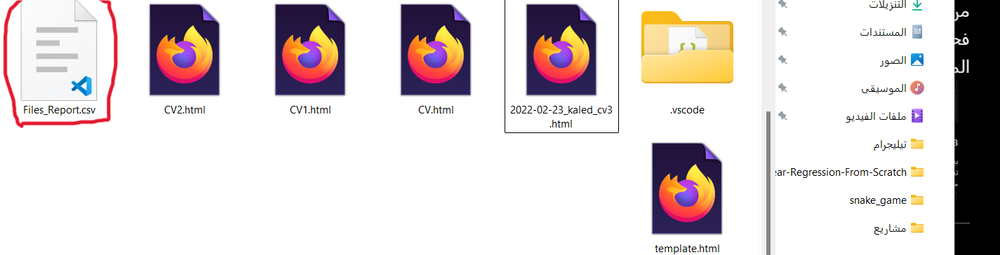

# 📂 أداة فحص ملفات الفريق (Team Files Verification Tool)

[](https://www.python.org/)
[](https://flet.dev/)


> **الحل الأمثل لإنهاء فوضى الملفات في بيئة العمل!**
أداة سطح مكتب حديثة (Desktop App) تهدف إلى مساعدة الفرق غير التقنية على اكتشاف الملفات المكررة، والملفات التي لا تتبع معايير التسمية، وإصدار تقارير فورية بذلك.

---

## 📸   شرح طريقة الاستخدام مع نظرة على التطبيق (Screenshots)

### طريقة الاستخدام:
### الاداه تفحص اسماء الملفات بحيث تفترض أن الملفات الصحيحة تكون كالتالي:
#### 1. مكتوبة بصيغة YYYY-MM-DD_ANYTHING_ANYTHING.ext
#### مثلا(2026-01-01_example_fiel.md)

#### 2. أن لايكون الملف فارغا

#### 3. أن لا يكون محتوى الملف مكررا في ملف آخر حتى ولو باسم مختلف


### نظرة عامة:
### 1. الواجهة الرئيسية
واجهة نظيفة وداعمة للوضع الداكن (Dark Mode) مع تعليمات واضحة.




### 2. عملية الفحص والنتائج
نظام تسجيل لحظي (Live Logs) يظهر للمستخدم حالة كل ملف، وعرض ملخص النتائج فور الانتهاء.




### 3. التقرير 
بعد النتهاء تقوم الاداه بعمل تقرير في ملف (CSV) يتم تسجيل في الملفات وحالتها مع بيان سبب اعتبارها مرفوضة, ويتم حفظ التقرير في نفس المجلد الذي تم فحص الملفات المتواجدة فيه, لكي يكون كل تقرير في المجلد الذي فام بفحصه.


### 4. ملف (log) 
ملف log يتم حفظه في نفس مسار تشغيل الاداه.


---

## 🚀 المميزات الرئيسية
1.  **واجهة رسومية (GUI) عصرية:** مبنية باستخدام مكتبة `Flet` لتجربة مستخدم سهلة وسلسة.
2.  **كشف التكرار الذكي:** يعتمد على (SHA-256 Hashing) لمقارنة محتوى الملفات، وليس الأسماء فقط.
3.  **معايير التسمية (Naming Pattern):** يفرض نمطاً مؤسسياً للتسمية: `التاريخ_نص_نص`.
4.  **تجاهل الملفات الذكي:** يتجاهل تلقائياً ملفات النظام، الملفات المخفية، وملفات القفل المؤقتة (`~$`).
5.  **تقارير CSV:** تصدير تقرير شامل بحالة كل ملف في نفس المجلد تلقائياً.

---

## 🛠️ المتطلبات والتشغيل

للتشغيل، تأكد من تثبيت [Python](https://www.python.org/downloads/) على جهازك.

### 1. تثبيت المكتبات المطلوبة وتشغيل الادة
فقط مكتبة `flet` هي المطلوبة لعمل الواجهة.

```bash
git clone https://github.com/your-username/files-checker-tool.git
cd files-checker-tool

pip install -r requirements.txt

python main.py

